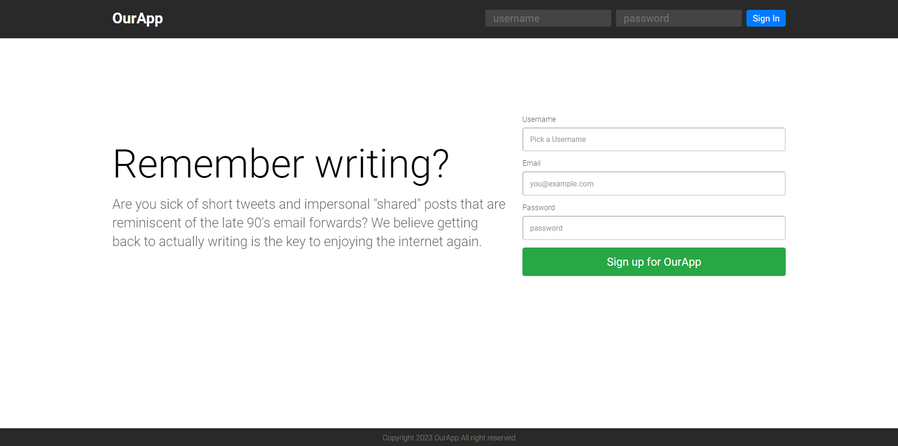
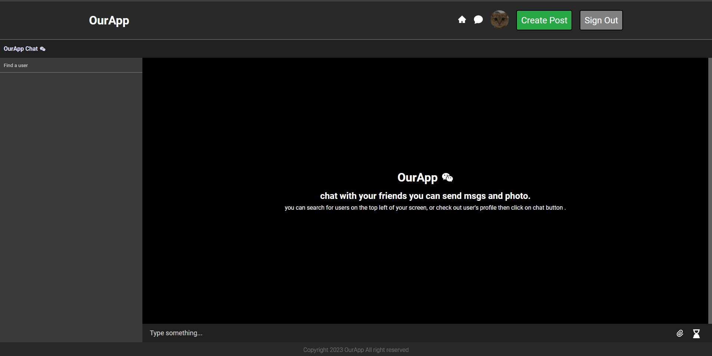
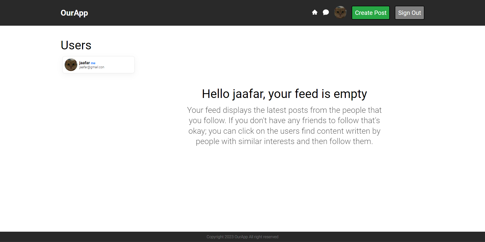
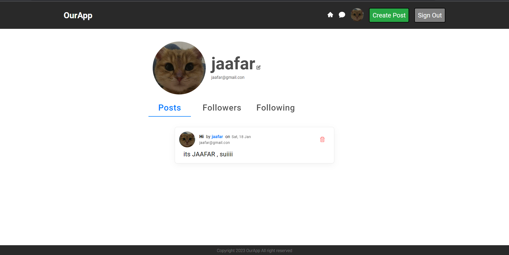

# Build and Deploy social Media rect website using React 18! (firebase with email and password Authentication)

Build and Deploy social Media website using React 18! where you will be able to sign in in and sign out using firebase email and password Authentication, creating posts, and chating with your freinds.

## Welcome! 
Thanks for checking out this Application.

## Overview

### Links
- Live Site URL: [Live Site](https://superlative-seahorse-c1c209.netlify.app/)

## My process

### Built with

- React Js
- Material UI
- firebase
- contextApi
- react router dom
- JavaScript
- JSX

## Author

- Linkedin - [@jaafar youssef](https://www.linkedin.com/in/jaafar-youssef-923100249/)

jaafar youssef
